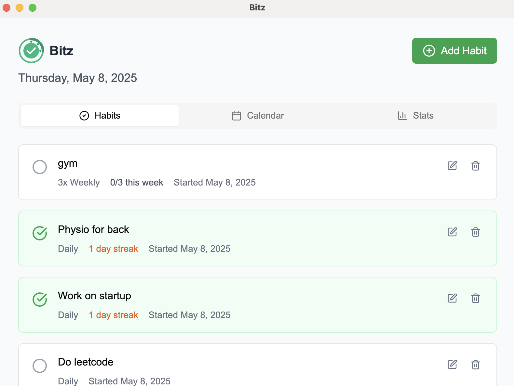

#  Bitz

make your to-dos into habitz

Here's a glimpse of the Bitz main interface:




Bitz is a cross-platform desktop application built with [Electron](https://www.electronjs.org/) and [Next.js](https://nextjs.org/), designed to help you manage your tasks and build positive habits efficiently.

## Platform Support

Bitz is built to run on the following platforms:
*   macOS (Intel and Apple Silicon)
*   Windows
*   Linux

Build scripts are configured to generate installers/packages for these platforms (DMG for macOS, NSIS for Windows, AppImage for Linux).

## Key Technologies

*   **Framework:** Electron
*   **UI:** Next.js / React
*   **Package Manager:** pnpm
*   **Build Tool (Electron):** electron-builder

## Prerequisites

Before you begin, ensure you have met the following requirements:
*   You have installed the latest version of [Node.js and npm](https://nodejs.org/en/download/)
*   You have installed [pnpm](https://pnpm.io/installation)

## Installation

To install the project dependencies, run the following command in your terminal:

```bash
pnpm install
```

## Development

To run the application in development mode (which will start both the Next.js frontend and the Electron app), use:

```bash
pnpm run dev
```

This will typically:
1.  Start the Next.js development server (usually on `http://localhost:3000`).
2.  Wait for the Next.js server to be ready.
3.  Start the Electron application.

Individual development scripts:
*   To run only the Next.js development server:
    ```bash
    pnpm run dev:next
    ```
*   To run only the Electron app (assuming the Next.js server is already running on port 3000):
    ```bash
    pnpm run dev:electron
    ```

## Building the Application

To build the application for production, run:

```bash
pnpm run build
```
This command will:
1.  Build the Next.js application (`pnpm run build:next`).
2.  Build the Electron application using electron-builder (`pnpm run build:electron`).

The build output will be located in the `dist` directory, as specified in `package.json`.

## Available Scripts

Here is a list of the primary scripts available in `package.json`:

*   `pnpm run dev`: Starts the application in development mode (Next.js + Electron).
*   `pnpm run dev:next`: Starts only the Next.js development server.
*   `pnpm run dev:electron`: Starts only the Electron application.
*   `pnpm run build`: Builds both the Next.js frontend and the Electron application.
*   `pnpm run build:next`: Builds only the Next.js frontend.
*   `pnpm run build:electron`: Builds only the Electron application.
*   `pnpm run start:next`: Starts the Next.js production server (after running `build:next`).
*   `pnpm run lint`: Lints the Next.js project.

## Downloads

You can download the latest version of Bitz for macOS, Windows, and Linux from our [GitHub Releases page](https://github.com/choonspin/Bitz/releases).
